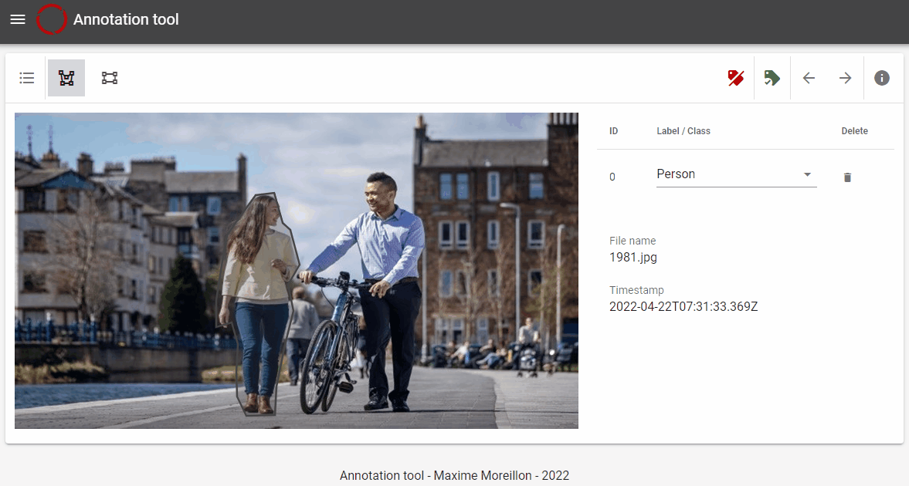

# Polygonal annotation tool

This is an anotation tool for imaga datsets intended to be used in AI applications. 
It allows the highlight of an image area via the drawing of polygons, directly in the web browser.

  

## Environment variables
| Variable | Description |
| --- | --- |
| VITE_STORAGE_SERVICE_API_URL | The URL of the storage service |
| VITE_LABELS | Comma‑separated list of predefined labels |
| VITE_DEFAULT_LABEL | Default label selected when creating a new annotation |
| VITE_ANNOTATION_FIELD | Name of the field where annotations are stored |
| VITE_CATEGORIZER | Field used to categorize or group annotations |
| VITE_DISPLAYED_FIELDS | Comma‑separated list of fields to display in the UI |
| VITE_ENABLE_BRUSH | Enables the brush tool (true/false) |
| VITE_ENABLE_POLYLINE | Enables the polyline drawing tool (true/false) |
| VITE_HELPER_RECTANGLE | Four comma‑separated coordinates defining a helper rectangle (x1,y1,x2,y2) |
| VITE_I18N_LOCALE | Default locale (e.g. `en`, `ja`) |
| VITE_I18N_FALLBACK_LOCALE | Fallback locale when a translation is missing |

### Authentication (Standard)
| Variable | Description |
| --- | --- |
| VITE_IDENTIFICATION_URL | URL to retrieve user information |
| VITE_LOGIN_URL | Direct login endpoint |
| VITE_LOGIN_HINT | Preset login hint used to pre‑fill login forms |
| VITE_HOMEPAGE_URL | URL to redirect users after authentication |

### Authentication (OIDC)
| Variable | Description |
| --- | --- |
| VITE_OIDC_AUTHORITY | OIDC authority (issuer) URL |
| VITE_OIDC_CLIENT_ID | Client ID used for OIDC authentication |
| VITE_OIDC_AUDIENCE | Audience identifier for OIDC tokens |

## Container images

Container images are available on the [AWS ECR Public Gallery](https://gallery.ecr.aws/u6l4m3e5/polygonal-annotation-tool)
